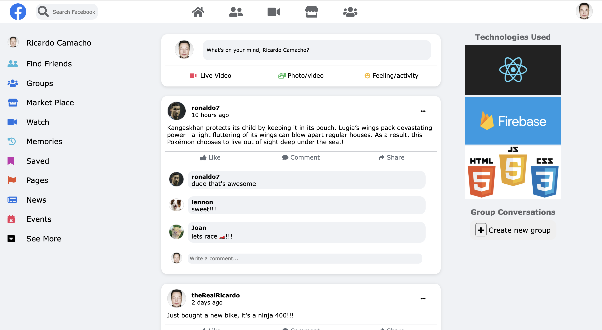

# Facebook-Clone (under progress)

This is a basic clone of the social media website Facebook.

### Current Live Version:

[Facebook Clone](https://rcamach7.github.io/facebook-clone/).


#### Built Using:

- React Framework
- Javascript
- HTML
- CSS

#### Local Installation & Running

```bash
git clone https://github.com/rcamach7/facebook-clone.git
cd facebook-clone
npm install
npm run start
```

### Bugs

-

#### Improvements

<!-- - Reduce spacing for individual post comments between each other. -->
<!-- - html semantic check - make sure html components carry appropriate html semantics -->
<!-- - slightly reduce post comment top and bottom padding -->

<!-- - whenever there are no comments, remove the num comments portion - right now shows 0 comments as opposed to just not displaying anything instead. -->

<!-- - do not allow empty fields whenever posting a post or a comment - form validation -->

<!-- - on the left sidebar, add small blue squares with all technology used to create this web application. -->

- Add ability to add a picture to a post
- when commenting or liking a comment, everything updates correctly, but it resets the post and you have to scroll back down to view your comment or updated likes - see if i can narrow down the field I change on the function call so the post view isn't "reset"
<!-- - remove comment button on the post sub navbar - or implement a way for highlighting the comment portion whenever that button is pressed. -->
- Add Emoji and Comment Enhancement icons at the end of add a comment bar for nicer UI
